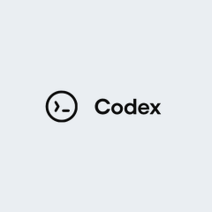
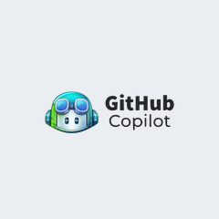
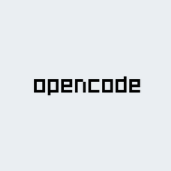

# git-ai   <a href="https://discord.gg/XJStYvkb5U"></a>        


Git AI is an open source git extension that tracks AI-generated code in your repositories.

Once installed, it automatically links every AI-written line to the agent, model, and transcripts that generated it — so you never lose the intent, requirements, and architecture decisions behind your code.

**AI attribution on every commit:**

`git commit`
```
[hooks-doctor 0afe44b2] wsl compat check
 2 files changed, 81 insertions(+), 3 deletions(-)
you  ██░░░░░░░░░░░░░░░░░░░░░░░░░░░░░░░░░░░░░░ ai
     6%             mixed   2%             92%
```

**AI Blame shows the model, agent, and session behind every line:**

`git-ai blame /src/log_fmt/authorship_log.rs`
```bash

cb832b7 (Aidan Cunniffe      2025-12-13 08:16:29 -0500  133) pub fn execute_diff(
cb832b7 (Aidan Cunniffe      2025-12-13 08:16:29 -0500  134)     repo: &Repository,
cb832b7 (Aidan Cunniffe      2025-12-13 08:16:29 -0500  135)     spec: DiffSpec,
cb832b7 (Aidan Cunniffe      2025-12-13 08:16:29 -0500  136)     format: DiffFormat,
cb832b7 (Aidan Cunniffe      2025-12-13 08:16:29 -0500  137) ) -> Result<String, GitAiError> {
fe2c4c8 (claude [session_id] 2025-12-02 19:25:13 -0500  138)     // Resolve commits to get from/to SHAs
fe2c4c8 (claude [session_id] 2025-12-02 19:25:13 -0500  139)     let (from_commit, to_commit) = match spec {
fe2c4c8 (claude [session_id] 2025-12-02 19:25:13 -0500  140)         DiffSpec::TwoCommit(start, end) => {
fe2c4c8 (claude [session_id] 2025-12-02 19:25:13 -0500  141)             // Resolve both commits
fe2c4c8 (claude [session_id] 2025-12-02 19:25:13 -0500  142)             let from = resolve_commit(repo, &start)?;...
```


### Supported Agents

<table>
<tr>
<td align="center" width="20%"></td>
<td align="center" width="20%"></td>
<td align="center" width="20%"></td>
<td align="center" width="20%"></td>
<td align="center" width="20%"></td>
</tr>
<tr>
<td align="center"></td>
<td align="center"></td>
<td align="center"></td>
<td align="center"></td>
<td align="center"></td>
</tr>
<tr>
<td align="center"></td>
<td align="center"></td>
<td align="center"></td>
<td align="center"></td>
<td align="center"><a href="https://usegitai.com/docs/cli/add-your-agent">+ Add an Agent</a></td>
</tr>
</table>


## Install

**Mac, Linux, Windows (WSL)**

```bash
curl -sSL https://usegitai.com/install.sh | bash
```

**Windows (non-WSL)**

Non-WSL Windows support is currently experimental and under active development. We would love to hear your feedback while we work to get non-WSL Windows support production-ready.

```powershell
powershell -NoProfile -ExecutionPolicy Bypass -Command "irm https://usegitai.com/install.ps1 | iex"
```

That's it — **no per-repo setup required.** Prompt and commit as normal. Git AI tracks attribution automatically.


### Our Choices
- **No workflow changes** — Just prompt and commit. Git AI tracks AI code accurately without cluttering your git history.
- **"Detecting" AI code is an anti-pattern** — Git AI does not guess whether a hunk is AI-generated. Supported agents report exactly which lines they wrote, giving you the most accurate attribution possible.
- **Local-first** — Works 100% offline, no login required.
- **Git native and open standard** — Git AI built the [open standard](https://github.com/git-ai-project/git-ai/blob/main/specs/git_ai_standard_v3.0.0.md) for tracking AI-generated code with Git Notes.
- **Secure Prompt Storage** — Git AI links each line of AI-code to the prompt that generated it. Since v1.0.0 Agent Sessions are stored outside of Git and can optionaly be synced to your team's [cloud](https://usegitai.com/docs/platform/overview) or [self-hosted](https://usegitai.com/docs/platform/self-hosting) prompt store -- keeping repos lean, enabling fine-grained access control, and preventing PII or secrets from leaking into Git.

### How Git AI works
1. **`Edit|Write|Bash` Hooks** get triggered as Agents make changes to a repository
2. **Hooks call `git-ai checkpoint`** to link each line of AI-Code to the model, Agent and prompt that generated it.
3. **Post Commit** a Git Note with AI-attributions in it is attached to the commit
4. **On `merge --squash`, `rebase`, `cherry-pick`, `stash`, `pop`, `commit --amend`, etc** AI-attributions are automatically moved 

#### Example Note
`refs/notes/ai/commit_sha`
```
hooks/post_clone_hook.rs
  prompt_id_123 6-8
  prompt_id_456 16,21,25
main.rs
  prompt_id_123 12-199,215,311
---
...Prompt metadata including agent, model, and a link to the full session transcript
```

For more information [review Git AI's open standard for attributing AI-code with Git Notes](https://github.com/git-ai-project/git-ai/blob/main/specs/git_ai_standard_v3.0.0.md).


---

### Attribution Stats

Line-level AI-attribution let you track AI-code through the full SDLC. Track how much AI code gets accepted, committed, through code review, and into production — to identify which tools and practices work best.

```bash
git-ai stats --json
git ai stats <start_sha>..<end_sha> --json
```

Calculates % AI-code, AI-lines generated vs committed, accepted rates, human overrides broken down by tool and model. Learn more: [Stats command reference docs](https://usegitai.com/docs/cli/reference#stats). 


<details>
<summary>Example JSON output</summary>

```json
{
  "human_additions": 28,
  "mixed_additions": 5,
  "ai_additions": 76,
  "ai_accepted": 47,
  "total_ai_additions": 120,
  "total_ai_deletions": 34,
  "time_waiting_for_ai": 240,
  "tool_model_breakdown": {
    "claude_code/claude-sonnet-4-5-20250929": {
      "ai_additions": 76,
      "mixed_additions": 5,
      "ai_accepted": 47,
      "total_ai_additions": 120,
      "total_ai_deletions": 34,
      "time_waiting_for_ai": 240
    }
  }
}
```

</details>

For team-wide visibility, [Git AI For Teams](https://usegitai.com/enterprise) aggregates data at the PR, repository, and organization level:

- **AI code composition** — Track what percentage of code is AI-generated across your org.
- **Pull Request Stats** - measure % AI, token spend/efficiency and agent autonomy 
- **Full lifecycle tracking** — See how much AI code is accepted, committed, rewritten during code review, and deployed to production. Measure how durable that code is once it ships and whether it causes alerts or incidents.
- **Team and Contributor stats** — Identify who uses background agents effectively, who runs agents in parallel, and what teams getting the most lift from AI do differently.
- **Agent readiness** — Measure the effectiveness of agents in your repos. Track the impact of skills, rules, MCPs, test harnesses, and `AGENTS.md` changes across repos and task types.
- **Agent and model comparison** — Compare acceptance rates and output quality by agent and model.


### AI Blame

Git AI blame is a drop-in replacement for `git blame` that shows AI attribution for each line. It supports [all standard `git blame` flags](https://git-scm.com/docs/git-blame).

```bash
git-ai blame /src/log_fmt/authorship_log.rs
```

```bash
cb832b7 (Aidan Cunniffe 2025-12-13 08:16:29 -0500  133) pub fn execute_diff(
cb832b7 (Aidan Cunniffe 2025-12-13 08:16:29 -0500  134)     repo: &Repository,
cb832b7 (Aidan Cunniffe 2025-12-13 08:16:29 -0500  135)     spec: DiffSpec,
cb832b7 (Aidan Cunniffe 2025-12-13 08:16:29 -0500  136)     format: DiffFormat,
cb832b7 (Aidan Cunniffe 2025-12-13 08:16:29 -0500  137) ) -> Result<String, GitAiError> {
fe2c4c8 (claude         2025-12-02 19:25:13 -0500  138)     // Resolve commits to get from/to SHAs
fe2c4c8 (claude         2025-12-02 19:25:13 -0500  139)     let (from_commit, to_commit) = match spec {
fe2c4c8 (claude         2025-12-02 19:25:13 -0500  140)         DiffSpec::TwoCommit(start, end) => {
fe2c4c8 (claude         2025-12-02 19:25:13 -0500  141)             // Resolve both commits
fe2c4c8 (claude         2025-12-02 19:25:13 -0500  142)             let from = resolve_commit(repo, &start)?;
fe2c4c8 (claude         2025-12-02 19:25:13 -0500  143)             let to = resolve_commit(repo, &end)?;
fe2c4c8 (claude         2025-12-02 19:25:13 -0500  144)             (from, to)
fe2c4c8 (claude         2025-12-02 19:25:13 -0500  145)         }
```

There are community plugins that display AI-attribution in popular IDEs, color-coded by agent session. Hover over a line to see the raw prompt or summary.

<table style="table-layout:fixed; width:100%">
<tr>
<th width="35%">Supported Editors</th>
<th width="65%"></th>
</tr>
<tr>
<td valign="top">

- [VS Code](https://marketplace.visualstudio.com/items?itemName=git-ai.git-ai-vscode)
- [Cursor](https://marketplace.visualstudio.com/items?itemName=git-ai.git-ai-vscode)
- [Windsurf](https://marketplace.visualstudio.com/items?itemName=git-ai.git-ai-vscode)
- [Antigravity](https://marketplace.visualstudio.com/items?itemName=git-ai.git-ai-vscode)
- [Emacs magit](https://github.com/jwiegley/magit-ai)
- *Built support for another editor? [Open a PR](https://github.com/git-ai-project/git-ai/pulls)*

</td>
<td>

</td>
</tr>
</table>


### Understand Why with the `/ask` Skill

See something you don't understand? The `/ask` skill lets you talk to the agent that wrote the code about its instructions, decisions, and the intent of the engineer who assigned the task. Git AI adds the `/ask` skill to `~/.agents/skills/` at install time so you can talk to it from any agent. 

```
/ask Why didn't we use the SDK here?
```

Agents with access to the original intent and source code understand the "why." Agents that can only read the code can tell you what it does, but not why:

| Reading Code + Transcript (`/ask`) | Only Reading Code (not using Git AI) |
|---|---|
| When Aidan was building telemetry, he instructed the agent not to block the exit of our CLI flushing telemetry. Instead of using the Sentry SDK directly, we came up with a pattern that writes events locally first via `append_envelope()`, then flushes them in the background via a detached subprocess. This keeps the hot path fast and ships telemetry async after the fact. | `src/commands/flush_logs.rs` is a 5-line wrapper that delegates to `src/observability/flush.rs` (~700 lines). The `commands/` layer handles CLI dispatch; `observability/` handles Sentry, PostHog, metrics upload, and log processing. Parallel modules like `flush_cas`, `flush_logs`, `flush_metrics_db` follow the same thin-dispatch pattern. |


<details>
<summary><h1 style="display:inline"> Make Your Agents Smarter</h1></summary>

Agents make fewer mistakes and produce more maintainable code when they understand the requirements and decisions behind the code they build on. The best way to provide this context is to give agents the same `/ask` tool you use yourself. Tell your agents to use `/ask` in plan mode:

`Claude|AGENTS.md`
```markdown
- In plan mode, always use the /ask skill to read the code and the original transcript that generated it. Understanding intent will help you write a better plan.
```

</details>


# License
Apache 2.0
