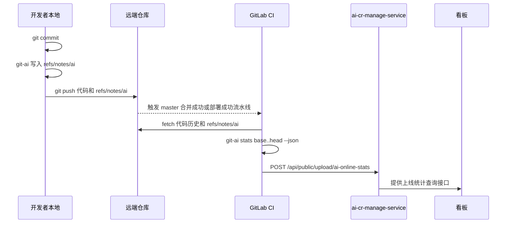

# git-ai 上线代码 AI 占比统计方案

## 0. 先用最容易懂的话讲一遍

先直接说结论：**这份文档原来的版本，小学生基本看不懂。**

原因不是内容错了，而是里面有很多技术词，比如 `commitId`、`baseCommit`、`headCommit`、`diff`、`MR`、`CI`、`unknownAdditions`。这些词对研发同学是正常表达，但对小学生、产品、运营，甚至刚接触 Git 的同学来说都太硬了。

所以这里先加一层“白话版”，后面原来的章节继续保留，给技术同学看细节。

如果只想快速明白这份方案在说什么，读完这一章就够了。

### 0.1 这份方案到底想算什么

我们真正想知道的不是：

```text
开发的时候，AI 一共帮大家写过多少代码
```

我们真正想知道的是：

```text
最后真的上线了、还留在系统里的代码里，有多少是 AI 帮忙写的
```

这两个问题看起来很像，其实不是一回事。

因为开发的时候，AI 可能先帮忙写了很多代码，但后面人又删掉了一部分、改掉了一部分，最后真正上线的，可能只剩下一小部分。

### 0.2 为什么不能只看开发过程里的每次提交

可以把写代码想成写作文。

比如：

1. AI 先帮你写了 10 句话。
2. 你觉得其中 6 句话写得不好，就删掉了。
3. 你自己又补了 5 句话。
4. 最后真正交上去的作文里，只剩下 AI 写的 4 句话。

如果我们只看“写作文过程中 AI 一共写了多少句”，答案是 10 句。

但如果我们看“最后交上去的作文里，AI 写了多少句”，答案是 4 句。

我们这次方案要统计的，是第二种，也就是：**最后真正留下来的那部分。**

### 0.3 这件事要怎么做

可以把整个过程理解成 4 步：

1. 先找到“这次到底是哪一批代码真的上线了”。
2. 再看这批代码最后新增了多少行。
3. 然后把这些新增行分成三类：`AI 写的`、`人写的`、`暂时看不清是谁写的`。
4. 最后把结果放到看板里，给总览和成员排行榜使用。

### 0.3.1 需不需要把本地统计结果 push 到远端

**不需要把“本地统计结果 JSON”当成代码文件一样 push 到远程仓库。**

这里最容易搞混的是两件事：

1. `统计结果`：比如某次计算出来的 AI 占比、AI 行数、unknown 行数。
2. `归因证据`：也就是 git-ai 写在 `refs/notes/ai` 里的 note。

这个方案真正需要同步到远端的，不是前者，而是后者。

可以简单理解成：

1. 开发者本地 commit 后，git-ai 会先在本地写一份“归因证据”。
2. 这份归因证据要能被 CI 拿到，所以它需要被同步到远端，或者同步到另一个大家都能访问到的中心位置。
3. 真正的“上线统计结果”不是开发者本地算完再 push，而是 CI 在 master 合并或生产部署成功后统一计算。
4. CI 算完后，把结果上传到后端数据库和看板，而不是 push 回 Git 仓库。

所以更准确地说：

```text
不是要求用户把本地统计结果 push 到远程仓库，
而是要求归因证据能够被 CI 拿到。
```

在当前 git-ai 的实现思路里，最简单的办法就是：

```text
开发者正常 git push 代码时，顺便把 refs/notes/ai 一起同步到远端。
```

这通常可以做成自动同步，不一定要求用户额外手工执行一次单独的 push 命令。

如果这份 `refs/notes/ai` 没有被同步到 CI 能拿到的地方，会发生什么？

答案是：

1. CI 还是能算出“总共新增了多少行”。
2. 但很多行会因为缺少证据，被算进 `unknown`。
3. 这样最后的 AI 占比可信度就会下降。

### 0.3.2 先看图：数据到底怎么走

如果只看文字，最容易误会成“开发者要把本地统计结果 push 到仓库”。

实际上，正确的数据流是下面这样：

```mermaid
flowchart LR
  A[开发者本地写代码] --> B[git commit]
  B --> C[git-ai 在本地写入归因证据<br/>refs/notes/ai]
  C --> D[开发者正常 git push]
  D --> E[远端仓库拿到两类东西<br/>1. 代码提交<br/>2. refs/notes/ai]
  E --> F[GitLab CI 在 master 合并成功<br/>或生产部署成功后启动]
  F --> G[CI 拉代码历史和 refs/notes/ai]
  G --> H[CI 执行 git-ai stats base..head --json]
  H --> I[得到上线统计结果 JSON]
  I --> J[上传到 ai-cr-manage-service]
  J --> K[存入上线统计表]
  K --> L[看板展示上线 AI 占比]
```



这张图里最重要的区别只有一句话：

```text
推到远端仓库的是归因证据 refs/notes/ai，
上传到后端服务的是统计结果 JSON。
```

如果你更习惯看“谁先做、谁后做”，那就看下面这张时序图：



看完这两张图，再记一句最短的话就不会搞混：

```text
本地负责产生日志，远端仓库负责带住证据，CI 负责统一计算，后端负责存储和展示。
```

### 0.3.3 到底怎么“要求用户把 note 推远端”

真正可执行的做法，不应该是靠群里发通知：

```text
大家记得把 notes 也推上去。
```

这种做法基本一定会漏。

正确做法应该分 3 层。

#### 第 1 层：默认自动推，不要求用户额外记忆

最理想的规则是：

```text
研发同学只需要正常 git push 代码，
notes 的同步由 git-ai 自动完成。
```

当前 git-ai 代码里已经有这个方向的能力：普通 `git push` 流程里会进入 `push_hooks`，并调用 `push_authorship_notes(...)` 去同步 `refs/notes/ai`。

所以从设计上，最推荐的要求不是：

```text
要求用户多执行一步手工推 notes
```

而是：

```text
要求用户必须使用被 git-ai 接管的 git push 流程。
```

也就是：

1. 团队机器统一安装 git-ai。
2. 让日常 `git commit`、`git push` 经过 git-ai 的代理 / hook。
3. 用户继续按原来的习惯 push 代码，不额外增加记忆负担。

#### 第 2 层：CI 做强校验，没推到就报警或失败

只有“自动推”还不够，还要有兜底检查。

最实用的办法是在 master 合并流水线或部署流水线里增加一条校验规则：

```text
如果本次统计范围里的关键 commit 没有对应的 refs/notes/ai，
就告警，或者直接让统计任务失败。
```

可以按团队成熟度分两档：

1. 宽松模式：先告警，不拦主流程，只在看板标记 `unknown` 偏高。
2. 严格模式：关键分支（例如 master / prod）缺 note 就让统计任务失败，逼着团队修同步链路。

这样一来，就不是“靠用户自觉”，而是“系统发现缺 note 就立即暴露”。

#### 第 3 层：给一条手工补救命令

即使有自动同步，也要给运维和研发负责人留一个补救入口。

当前可以预留两种补救方式：

方式 A：走 git-ai 命令。

```bash
git ai push-authorship-notes origin
```

方式 B：直接用 Git refspec 推送 notes。

```bash
git push origin refs/notes/ai:refs/notes/ai
```

这样当某个仓库历史上 notes 没推上去，或者某台机器自动同步失效时，可以人工补一次。

#### 这 3 层合起来，才是真正的“要求方式”

所以最终落地时，管理口径不要写成：

```text
要求每个开发手工把 note push 到远程
```

而应该写成：

```text
1. 默认由 git-ai 在正常 git push 时自动同步 refs/notes/ai。
2. CI 负责检查 notes 是否到位，缺失时告警或失败。
3. 提供手工补救命令，用于历史回补和故障修复。
```

这样才是一个能执行、能落地、也不容易漏的方案。

### 0.4 文档里的难词，翻成白话就是这些意思

| 词 | 白话解释 |
| --- | --- |
| `commit` | 一次保存记录，可以理解成“代码存档点” |
| `commitId` | 这次保存记录的编号 |
| `baseCommit` | 这次比较的起点，也就是“从哪里开始算” |
| `headCommit` | 这次比较的终点，也就是“最后看到哪里” |
| `diff` | 前后有什么不同 |
| `MR` | 把开发分支代码合回主分支的一次申请 |
| `CI` | 自动跑流程的机器人，比如自动构建、自动统计 |
| `AI 行` | 最后还能证明是 AI 帮忙写出来的代码行 |
| `人工行` | 最后能证明是人自己写的代码行 |
| `unknown` | 现在证据不够，暂时看不出来是谁写的 |

### 0.5 用一个最简单的例子理解

假设这次上线，最终一共新增了 100 行代码：

1. 其中 40 行最后能确认是 AI 帮忙写的。
2. 其中 50 行最后能确认是人自己写的。
3. 还有 10 行现在看不清到底是谁写的。

那这次上线的核心结果就是：

```text
上线 AI 占比 = 40 / 100 = 40%
```

不是拿 AI 在开发过程中“曾经写过多少行”来算，而是拿**最后真正保留下来的 AI 行数**来算。

### 0.6 为什么成员排行榜也要改

因为现在如果按“每次提交的平均比例”来算，容易不公平。

比如：

1. 小明只提交了 1 行，而且这 1 行是 AI 写的，那他就是 100%。
2. 小红提交了 100 行，其中 50 行是 AI 写的，她是 50%。

如果直接按百分比排，小明会排在小红前面，但这并不代表他真的贡献更多。

所以成员排行榜应该看：

```text
最后真正上线的代码里，每个人实际留下了多少 AI 代码
```

这样才更公平。

### 0.7 一句话记住整篇文档

这份方案的核心不是统计“AI 在开发过程中写过多少”，而是统计：

```text
最后真的上线、真的还留着的代码里，AI 占多少
```

### 0.8 如果现在就开始做，按这个顺序做

如果要真正落地，不要一上来就把所有功能一起做完。正确顺序是：**先把“总量统计”跑通，再补“成员榜”，最后再补“生产口径”和“全库快照”。**

下面按顺序写清楚。

#### 第 1 步：先定死这次到底要统计什么

先不要急着写代码，第一步先统一口径，不然后面所有人都会各说各话。

这一阶段要定 4 件事：

1. 统计对象先定为：`最终上线后还保留下来的新增代码`。
2. 第一阶段先统计：`MR 合入 master 后的最终结果`。
3. 先不做：`整个代码库全量 AI 占比`。
4. `unknown` 必须单独展示，不能算成人工，也不能丢掉。

这一步做完后的结果应该是一句话：

```text
第一阶段，我们先统计 master 合并后最终保留下来的新增代码里，AI 占多少。
```

#### 第 2 步：先选一个最简单的场景开工

不要一开始就同时支持 master、release、prod、squash、rebase、fast-forward 全部场景，那样很容易把项目做复杂。

第一阶段建议只做这个最简单场景：

```text
GitLab MR 合入 master 后，pipeline 成功，统计这次合并最终留下来的 AI 代码占比。
```

这样做的原因是：

1. 场景最清楚。
2. 最容易验证结果对不对。
3. 后面再往 prod 和 release 扩展时，不用推翻重来。

#### 第 3 步：CI 里先拿到两个最关键的提交点

这一步是整个方案最关键的入口。

CI 在 master pipeline 成功后，要先拿到：

1. `headCommit`：这次最终合入 master 的那个提交。
2. `baseCommit`：这次统计的起点，也就是“合并前 master 停在哪里”。

如果是最常见的 no-ff merge，可以先按下面理解：

```text
baseCommit = merge^1
headCommit = merge
```

这一阶段先不用追求把所有合并策略都做满，先把最常见场景跑通。

#### 第 4 步：CI 把 git-ai 的归因证据拉全

拿到 `baseCommit` 和 `headCommit` 后，下一步不是马上算结果，而是先把证据拉全。

CI 里至少要做这些事：

1. 拉完整 Git 历史，保证 `baseCommit..headCommit` 这段历史在本地是完整的。
2. 执行 `git-ai fetch-notes`，把 `refs/notes/ai` 拉下来。
3. 如果是 squash 或 rebase，再执行 `git-ai ci gitlab run`，把归因信息改写到最终提交上。

如果这一步没做对，后面统计出来的很多代码都会掉到 `unknown`。

#### 第 5 步：先只算“总量”，不要一开始就算成员榜

这一步建议先用现有能力跑出最核心结果，不要一开始就做太多维度。

先执行：

```bash
git-ai stats "${BASE_COMMIT}..${HEAD_COMMIT}" --json
```

先只拿这几个结果：

1. 最终新增总行数。
2. 其中 AI 行数。
3. 其中人工行数。
4. 其中 unknown 行数。
5. AI 占比。
6. unknown 占比。

第一阶段先把“总量结果对不对”跑通，比什么都重要。

#### 第 6 步：后端先加一条新的上传通道，不要复用旧接口

当前旧接口是给“开发过程 commit 统计”用的，不适合直接塞“上线统计”。

所以后端第一阶段先做两件事：

1. 新增接口：`POST /api/public/upload/ai-online-stats`
2. 新增总表：`git_ai_online_stats`

这一阶段先不要急着做太多子表，先让一条上线事件能被存下来。

存的时候最少保存这些字段：

1. `repoUrl`
2. `projectName`
3. `targetBranch`
4. `environment`
5. `baseCommit`
6. `headCommit`
7. `totalAddLine`
8. `aiAddLine`
9. `manualAddLine`
10. `unknownAddLine`
11. `aiRatio`
12. `unknownRatio`

#### 第 7 步：看板先只上一屏最核心的数据

第一版看板不要贪多，先只上最重要的 4 个数字：

1. 上线总新增行。
2. 上线 AI 行。
3. 上线 AI 占比。
4. unknown 占比。

这样做的目的是先证明这条链路已经真的打通了：

```text
CI 能算 -> 后端能收 -> 数据库能存 -> 前端能看
```

只要这 4 个数字稳定出来，第一阶段就算成功。

#### 第 8 步：跑几次真实 MR，人工核对结果对不对

这一步不能省。

至少找 3 到 5 个真实 MR 做人工抽查：

1. 看最终 diff 一共有多少新增行。
2. 抽一些文件，看 AI 行是不是大致合理。
3. 看 `unknown` 是不是过高。
4. 看 squash / rebase 场景有没有明显错误。

如果抽查时发现 `unknown` 很高，不要急着继续扩功能，先回头修 CI 拉 notes、归因改写、历史拉取不完整这些问题。

#### 第 9 步：总量稳定后，再做成员排行榜

总量跑稳之后，第二阶段再做成员榜。不要反过来。

因为成员榜比总量更难，必须知道：

1. 这行代码最后算到哪个人头上。
2. 这个人是系统里的谁。
3. 这个提交作者邮箱怎么映射成系统用户。

这一步通常要补：

1. `git_ai_online_member_stats` 表。
2. 行级归属逻辑。
3. 用户映射逻辑。
4. 新的排行榜接口。

而且排行榜必须按下面这个公式做：

```text
成员上线 AI 占比 = SUM(成员上线 AI 行) / SUM(成员上线总新增行)
```

不能再按每次提交的平均值做。

#### 第 10 步：成员榜稳定后，再补文件明细和工具模型明细

当总量和成员榜都稳定以后，再做这些“锦上添花”的东西：

1. 哪些文件 AI 占比高。
2. 哪些工具贡献了多少 AI 行。
3. 哪些模型贡献了多少 AI 行。
4. 哪个 MR / 哪次发布的 AI 占比最高。

这一阶段对应的是更细的分析，不是第一阶段必须项。

#### 第 11 步：最后再接生产部署口径

如果团队真正关心“生产上线了多少 AI 代码”，那要在 master 口径稳定后，再接生产部署口径。

做法是把统计起点从：

```text
合并前的 master
```

改成：

```text
上一次成功部署到该环境的 commit
```

这样统计出来的，才是“这次真的发到 prod 的代码里，AI 占多少”。

#### 第 12 步：最难的“全库 AI 占比”放最后做

“整个仓库现在一共有多少 AI 代码”这件事最重、最慢、最容易扯皮，所以一定放最后做。

因为它要解决的问题比前面都多：

1. 哪些文件算代码。
2. 生成文件算不算。
3. 锁文件算不算。
4. SQL、配置、Markdown 算不算。
5. 全量 blame 的性能怎么控制。

所以这个功能不适合第一阶段立刻开工。

#### 第 13 步：一句话版本的正确开发顺序

如果要用最短的话总结，就是：

```text
先定口径 -> 先跑 master 合并总量 -> 再做后端新接口新表 -> 再上看板总览 -> 再人工核对 -> 再做成员榜 -> 再做文件明细 -> 最后接生产和全库快照
```

## 1. 技术版结论先说

当前看板里的“AI 编码数据统计”“成员 Top”“项目汇总”等指标，本质上是**提交期统计**：成员在本地 commit 后，git-ai 生成该 commit 的 authorship note 和 `stats`，随后上传到后端，后端再按 commit 聚合。

这套数据能回答：**开发过程中 AI 参与了多少提交、多少新增行、哪些人用了 AI、哪些工具和模型参与过。**

但它不能直接回答真正更关键的问题：**最后合并到 master / 发布到生产的代码里，实际还留下了多少 AI 代码。**

建议把看板拆成两套口径：

| 口径 | 解决的问题 | 是否作为主 KPI |
| --- | --- | --- |
| 开发过程口径 | 开发过程中 AI 使用活跃度、提交量、工具使用情况 | 否，作为过程分析 |
| 上线代码口径 | 最终进入 master / release / 生产部署代码中的 AI 占比 | 是，作为核心统计 |

你的想法“根据最终开发分支合并到 master 分支上的 commitId 来判断”方向是对的，但需要补齐上下文：**commitId 只能做上线事件锚点，不能单独作为统计口径。**

准确方案是：

1. 在 MR 合并到 master、release 分支构建成功或生产部署成功后，以最终 `headCommit` 作为统计锚点。
2. 找到本次上线范围的 `baseCommit`，例如 merge commit 的第一父提交，或上一次成功部署的 commit。
3. 在 CI 环境拉取完整 Git 历史和 `refs/notes/ai`。
4. 计算 `baseCommit..headCommit` 这个范围在最终代码中的真实 diff。
5. 对最终仍然存在的新增行做 AI / KnownHuman / Unknown 归因。
6. 把结果上传到后端新的“上线统计表”，看板主 KPI 和成员排行榜优先读这套上线统计。

核心公式：

```text
上线 AI 占比 = 上线范围内最终保留下来的 AI 归因新增行 / 上线范围内最终保留下来的总新增行
```

同时必须保留：

```text
未知归因占比 = unknownAdditions / totalAddedLines
归因覆盖率 = (aiAdditions + humanAdditions) / totalAddedLines
```

`unknownAdditions` 不能算人工，也不能悄悄丢掉；它代表“当前证据不足”。如果 unknown 比例高，说明 git-ai 安装覆盖、notes 同步、merge/squash authorship 重写或 CI 采集链路有问题。

## 2. 当前系统能提供什么

### 2.1 git-ai 侧现状

当前 git-ai 已经具备这些能力：

| 能力 | 当前实现 | 对上线统计的意义 |
| --- | --- | --- |
| 单 commit 归因 | commit 后写 `refs/notes/ai` | 上线统计的基础数据来源 |
| 单 commit 统计 | `git-ai stats <commit> --json` | 当前后端上传和看板主要口径 |
| 范围统计 | `git-ai stats <base>..<head> --json` | 可以作为上线增量统计的基础 |
| 自动上传 | `post_commit` 计算 stats 后调用上传模块 | 当前只适合普通非 merge commit 的过程统计 |
| 手动上传 | `git-ai upload-stats [commit...]` | 可以回补 commit 级数据 |
| CI merge 处理 | `git-ai ci github/gitlab run` | 可在 squash / rebase 后重写 authorship note |

其中最重要的是：`git-ai stats A..B --json` 已经不是简单累加每个 commit 的 `aiAdditions`，而是走 range authorship：它会看 `A..B` 最终 diff，并结合 authorship note 计算这个范围里最终保留下来的 AI 归因行。这个能力非常接近“上线增量口径”。

### 2.2 后端 ai-cr-manage-service 现状

后端当前入口和表结构大致是：

| 层次 | 当前实现 | 当前问题 |
| --- | --- | --- |
| 上传入口 | `/api/public/upload/ai-stats` | 只接收 commit 级 stats |
| 总表 | `git_ai_summary_stats` | 表示一次上传批次，不表示一次上线事件 |
| commit 表 | `git_ai_commit_stats` | 按 `commit_code` 去重，适合开发过程提交 |
| file 表 | `git_ai_file_stats` | 文件维度仍绑定 commit |
| tool/prompt 表 | `git_ai_tool_stats` / `git_ai_prompt_stats` | 可用于工具、模型、prompt 展示 |
| 看板接口 | `/git-ai/dashboard/*` | 聚合的是 commit 表，不知道哪些 commit 最终上线 |

当前成员 Top 的 SQL 还使用：

```text
AVG(c.ai_add_line / c.total_add_line)
```

这个口径会被“小提交”放大。例如一个人提交 1 行且 100% AI，另一个人提交 1000 行且 50% AI，直接平均 commit 比例并不适合作为上线排行榜。上线排行榜应该用加权口径：

```text
成员上线 AI 占比 = SUM(成员上线 AI 行) / SUM(成员上线总新增行)
```

## 3. 为什么不能只累加开发分支 commit

开发分支上的 commit 统计会遇到这些偏差：

1. **被删掉的 AI 代码会被重复计入。** 例如 AI 生成 500 行，后来人工删到 80 行，commit 累加会夸大 AI 使用量；上线口径只应统计最终剩下的 80 行。
2. **被 squash 后原 commit 不在 master。** 后端如果只看原始 commit，会统计到没有真正进入 master 历史的提交。
3. **rebase 后 commitId 会变化。** 原 commit 归因必须映射到 rebased commit，否则后端无法把上线 commit 和开发 commit 对上。
4. **merge commit 默认可能没有 stats。** git-ai 当前 post-commit 会跳过 merge commit 的快速 stats，不能指望 merge commit 自动上传出正确结果。
5. **冲突解决代码是特殊情况。** no-ff merge 时，如果合并过程中人工解决冲突新增了代码，这些行属于 merge commit 本身，不一定有 AI note，需要单独归因或标为 unknown。
6. **master 不等于生产。** 如果 master 合并后还要走发布窗口、灰度、release 分支，真正上线口径应以“成功部署 commit”为准，而不是单纯以“合入 master”为准。

所以：**commitId 可以作为入口，但统计必须基于最终代码状态和 range diff。**

## 4. 推荐的指标体系

### 4.1 主指标：上线增量 AI 占比

用于回答：这次 MR / 这次发布最终上线的新增代码里，AI 占多少。

```text
onlineAiRate = onlineAiAddLines / onlineTotalAddLines
```

字段建议：

| 字段 | 含义 |
| --- | --- |
| `onlineTotalAddLines` | `baseCommit..headCommit` 最终 diff 中的新增行 |
| `onlineAiAddLines` | 最终 diff 新增行中可归因到 AI 的行 |
| `onlineHumanAddLines` | 最终 diff 新增行中可归因到 KnownHuman 的行 |
| `onlineUnknownAddLines` | 最终 diff 新增行中没有归因证据的行 |
| `onlineAiRate` | `onlineAiAddLines / onlineTotalAddLines` |
| `onlineUnknownRate` | `onlineUnknownAddLines / onlineTotalAddLines` |
| `noteCoverageRate` | `(onlineAiAddLines + onlineHumanAddLines) / onlineTotalAddLines` |

### 4.2 辅助指标：当前存量 AI 占比

用于回答：当前 master / 生产部署 commit 的整个代码库里，存量代码有多少行可追溯为 AI。

```text
currentTreeAiRate = currentTreeAiLines / currentTreeTotalLines
```

这个指标适合月度、季度、里程碑看趋势，但不建议作为第一阶段 MVP。原因是它需要对整个代码树跑 blame，成本更高，还要定义哪些文件算“代码”：生成物、锁文件、配置、SQL、Markdown 是否纳入，都会影响结果。

第一阶段建议优先做**上线增量口径**；第二阶段再补**全库存量快照口径**。

### 4.3 成员排行榜口径

成员榜不要再按 commit 平均值排序，改为按上线留存行聚合。

推荐展示字段：

| 字段 | 计算方式 |
| --- | --- |
| 成员 | 优先 `X-USER-ID` / `sys_user.user_name`，其次 commit author 邮箱 |
| 上线 AI 行 | 该成员最终上线范围内 AI 归因新增行数 |
| 上线总新增行 | 该成员最终上线范围内总新增行数 |
| 上线 AI 占比 | `SUM(aiLines) / SUM(totalLines)` |
| 归因覆盖率 | `(SUM(aiLines) + SUM(humanLines)) / SUM(totalLines)` |
| MR / 发布次数 | 该成员参与的上线事件数 |

排序建议：

1. 默认按 `上线 AI 行` 倒序，体现实际贡献量。
2. 可切换按 `上线 AI 占比` 排序，但必须设置最小分母，例如 `onlineTotalAddLines >= 50`，避免 1 行 100% AI 排第一。
3. `unknownRate` 超过阈值，例如 20%，在前端标记“低可信”。

## 5. 基于 merge commitId 的统计流程

### 5.1 不同合并策略下的 base/head 选择

| 合并方式 | 最终 headCommit | baseCommit 取值 | 说明 |
| --- | --- | --- | --- |
| no-ff merge | merge commit | merge commit 第一父提交 `merge^1` | `merge^1..merge` 表示本次 MR 最终进入 master 的 diff |
| squash merge | squash commit | squash commit 父提交 `squash^` | 原分支 commit 不在 master，需要 CI 重写 authorship 到 squash commit |
| rebase merge | rebased 后最后一个 commit | GitLab 记录的合并前 target SHA，或本地 merge-base | 原 commitId 会变化，需要映射 authorship |
| fast-forward | source head commit | 合并前 master head | 没有 merge commit，不能只依赖 merge commitId |
| 发布 / 部署 | 部署 commit | 上一次成功部署 commit | 真正生产口径应以部署成功为准 |

### 5.2 GitLab 信息来源

当前后端已有 `GitLabApiClient.getMergeRequestCommits(projectName, commitId)`，它通过：

```text
GET /projects/:id/repository/commits/:commitId/merge_requests
GET /projects/:id/merge_requests/:iid/commits
```

查询 MR 包含的 commits。这个能力可以继续复用，但上线统计需要扩展获取更多字段：

| 字段 | 用途 |
| --- | --- |
| `iid` | 关联 MR，做明细跳转和幂等键辅助 |
| `source_branch` / `target_branch` | 判断是否合入 master / release |
| `merge_commit_sha` | no-ff merge 锚点 |
| `squash_commit_sha` | squash merge 锚点 |
| `sha` | MR source head |
| `squash` | 判断是否需要 authorship rewrite |
| 合并前 target SHA | rebase / fast-forward 场景的 baseCommit |

如果 GitLab API 对 merge commit 反查 MR 不稳定，要在 CI 回调里直接传 MR IID、source branch、target branch、merge strategy、base SHA 和 head SHA，不要让后端事后猜。

## 6. CI 采集方案

### 6.1 MR 合入 master 后采集

触发条件：master 分支 pipeline 成功，且本次 commit 能关联到 MR。

流程：

1. checkout master 到最终 `headCommit`。
2. fetch 完整历史，至少包含 `baseCommit..headCommit` 范围。
3. 执行 `git-ai fetch-notes`，拉取 `refs/notes/ai`。
4. 如果是 squash / rebase，执行 `git-ai ci gitlab run` 或等价逻辑，把源分支 authorship note 重写到最终 commit。
5. 计算上线范围：

```bash
git-ai stats "${BASE_COMMIT}..${HEAD_COMMIT}" --json
```

6. 生成上线统计 payload，上传到新的后端接口：

```text
POST /api/public/upload/ai-online-stats
```

7. 后端按 `(repoUrl, environment, metricScope, baseCommit, headCommit)` 幂等 upsert。

### 6.2 生产部署成功后采集

如果团队真正关心“上线到生产”，不要只看 master merge。应在生产部署成功后上传：

| 字段 | 说明 |
| --- | --- |
| `environment` | `prod` / `uat` / `dev` |
| `previousDeployCommit` | 该环境上一次成功部署 commit |
| `deployCommit` | 本次部署成功 commit |
| `releaseVersion` | 发布版本号 |
| `pipelineId` / `jobId` | 可追踪 CI 任务 |

统计范围：

```bash
git-ai stats "${PREVIOUS_DEPLOY_COMMIT}..${DEPLOY_COMMIT}" --json
```

这能回答：**这次生产发布新增代码里，最终 AI 占比是多少。**

## 7. git-ai 需要补的能力

第一阶段可以先用现有 `git-ai stats A..B --json` 得到总量；但如果要做成员排行榜、文件明细和工具模型明细，建议在 git-ai 中补一个原生命令。

### 7.1 新命令建议

```bash
git-ai online-stats \
  --base <baseCommit> \
  --head <headCommit> \
  --mode mr-final-delta \
  --json
```

可选上传命令：

```bash
git-ai upload-online-stats \
  --base <baseCommit> \
  --head <headCommit> \
  --target-branch master \
  --environment prod \
  --merge-commit <mergeCommit> \
  --mr-iid <iid> \
  --source gitlab-ci
```

### 7.2 计算算法

对 `baseCommit..headCommit`：

1. 用 `git diff --unified=0 --find-renames baseCommit..headCommit` 获取最终 diff 的新增行区间。
2. 过滤不参与统计的文件：`target/`、`node_modules/`、`dist/`、生成代码、锁文件、二进制文件等。
3. 对每个最终存在的文本文件，在 `headCommit` 上对新增行区间做 blame，得到每行的 origin commit 和 git author。
4. 对同一批行读取 git-ai authorship note，判断行归因：AI / KnownHuman / Unknown。
5. AI 行继续解析 prompt/tool/model；成员归属按“接受并提交该行的人”归属，而不是归属给工具。
6. 聚合出：总量、文件维度、成员维度、工具模型维度。

成员归属优先级：

1. 该 origin commit 在 `git_ai_commit_stats` 里已有 `x_user_id` / `user_name`。
2. 上传 payload 或 authorship metadata 中有 `X-USER-ID`。
3. `git blame` 的 author email 匹配 `sys_user.email`。
4. 兜底使用 commit author email。

### 7.3 输出 JSON 建议

```json
{
  "repoUrl": "https://gitlab.example.com/group/app.git",
  "projectName": "app",
  "targetBranch": "master",
  "environment": "prod",
  "metricScope": "release-delta",
  "baseCommit": "aaa111",
  "headCommit": "bbb222",
  "mergeCommit": "bbb222",
  "mrIid": "123",
  "mergeStrategy": "squash",
  "stats": {
    "totalAddLines": 1000,
    "aiAddLines": 420,
    "humanAddLines": 500,
    "unknownAddLines": 80,
    "totalDelLines": 120,
    "aiRate": 0.42,
    "unknownRate": 0.08,
    "noteCoverageRate": 0.92
  },
  "members": [
    {
      "author": "alice@example.com",
      "userName": "alice",
      "nickName": "Alice",
      "totalAddLines": 300,
      "aiAddLines": 180,
      "humanAddLines": 100,
      "unknownAddLines": 20,
      "aiRate": 0.6
    }
  ],
  "files": [
    {
      "filePath": "src/main/java/App.java",
      "totalAddLines": 120,
      "aiAddLines": 70,
      "humanAddLines": 40,
      "unknownAddLines": 10
    }
  ],
  "tools": [
    {
      "tool": "github-copilot",
      "model": "gpt-4.1",
      "aiAddLines": 260
    }
  ]
}
```

## 8. 后端表结构建议

### 8.1 上线事件总表 `git_ai_online_stats`

建议新增独立表，不要复用 `git_ai_summary_stats`。原因是 summary 表表示“一次上传批次”，不是“一次上线事件”。

关键字段：

| 字段 | 说明 |
| --- | --- |
| `id` | 雪花 ID，BIGINT |
| `repo_url` | 仓库地址 |
| `project_name` | 项目名 |
| `target_branch` | master / main / release 分支 |
| `environment` | prod / uat / dev，可为空表示只统计入主干 |
| `metric_scope` | `mr-final-delta` / `release-delta` / `full-tree-snapshot` |
| `merge_strategy` | merge / squash / rebase / fast-forward |
| `base_commit` | 统计起点 |
| `head_commit` | 统计终点，即最终上线 commit |
| `merge_commit` | MR merge commit，可为空 |
| `source_head_commit` | MR 源分支 head，可为空 |
| `mr_iid` | GitLab MR IID |
| `pipeline_id` / `job_id` | CI 追踪字段 |
| `total_add_line` | 最终上线新增行 |
| `ai_add_line` | 最终上线 AI 行 |
| `manual_add_line` | 最终上线 KnownHuman 行 |
| `unknown_add_line` | 最终上线 unknown 行 |
| `total_del_line` | 范围删除行 |
| `ai_ratio` | `ai_add_line / total_add_line` |
| `unknown_ratio` | `unknown_add_line / total_add_line` |
| `note_coverage_rate` | 归因覆盖率 |
| `computed_at` | CI 计算时间 |

唯一键建议：

```text
uk_online_event(repo_url, environment, metric_scope, base_commit, head_commit)
```

不要只按 `head_commit` 去重，因为同一个 commit 可以先部署 UAT，再部署生产；也可能同一 head 用不同 base 重新计算 release delta。

### 8.2 成员表 `git_ai_online_member_stats`

关键字段：

| 字段 | 说明 |
| --- | --- |
| `online_id` | 关联 `git_ai_online_stats.id` |
| `x_user_id` | 系统用户 ID，可为空 |
| `user_name` / `nick_name` | 系统用户信息 |
| `author` | commit author 邮箱 |
| `total_add_line` | 该成员最终上线新增行 |
| `ai_add_line` | 该成员最终上线 AI 行 |
| `manual_add_line` | 该成员最终上线 KnownHuman 行 |
| `unknown_add_line` | 该成员最终上线 unknown 行 |
| `ai_ratio` | 成员上线 AI 占比 |

### 8.3 文件表 `git_ai_online_file_stats`

关键字段：

| 字段 | 说明 |
| --- | --- |
| `online_id` | 关联上线事件 |
| `file_path` | 文件路径 |
| `total_add_line` | 文件最终上线新增行 |
| `ai_add_line` | 文件 AI 行 |
| `manual_add_line` | 文件 KnownHuman 行 |
| `unknown_add_line` | 文件 unknown 行 |

### 8.4 源 commit 明细表 `git_ai_online_commit_stats`

可选但建议保留，用于审计：

| 字段 | 说明 |
| --- | --- |
| `online_id` | 关联上线事件 |
| `commit_code` | 原始 commit |
| `author` | commit author |
| `total_add_line` | 该 commit 最终留存新增行 |
| `ai_add_line` | 该 commit 最终留存 AI 行 |
| `unknown_add_line` | 该 commit 最终留存 unknown 行 |

这个表能回答：“某个开发 commit 里最后到底留下了多少代码”。

## 9. 后端接口建议

### 9.1 上传接口

新增：

```text
POST /api/public/upload/ai-online-stats
```

不要塞进当前 `/upload/ai-stats`，避免 commit 统计和上线统计语义混在一起。

请求体顶层字段建议：

| 字段 | 说明 |
| --- | --- |
| `repoUrl` | 仓库 URL |
| `projectName` | 项目名 |
| `targetBranch` | master / main / release |
| `environment` | prod / uat / dev |
| `metricScope` | `mr-final-delta` / `release-delta` / `full-tree-snapshot` |
| `baseCommit` | 统计起点 |
| `headCommit` | 统计终点 |
| `mergeCommit` | merge commit，可为空 |
| `mrIid` | MR IID，可为空 |
| `mergeStrategy` | 合并方式 |
| `stats` | 总量统计 |
| `members` | 成员聚合 |
| `files` | 文件聚合 |
| `tools` | 工具模型聚合 |

### 9.2 看板查询接口

有两种实现方式。

方案 A：新增 online 前缀接口，语义最清晰。

```text
GET /git-ai/dashboard/online/stats
GET /git-ai/dashboard/online/trend
GET /git-ai/dashboard/online/member-top
GET /git-ai/dashboard/online/project-summary
GET /git-ai/dashboard/online/detail
```

方案 B：复用当前接口，加参数：

```text
metricScope=commit-process | online-delta | full-tree
```

推荐先用方案 A。原因是当前接口和 VO 字段命名已经默认指向 commit 统计，强行复用容易让前端和后端都混乱。

## 10. 看板展示建议

### 10.1 顶部卡片

主视图默认展示上线口径：

| 卡片 | 说明 |
| --- | --- |
| 上线总新增行 | final delta 总新增行 |
| 上线 AI 行 | final delta 中 AI 行 |
| 上线 AI 占比 | `AI 行 / 总新增行` |
| Unknown 占比 | 归因缺口 |
| 归因覆盖率 | 数据可信度 |

当前“提交数、AI 生成率、AI 采纳率、节省工时”保留，但移动到“开发过程”页签。

### 10.2 成员 Top

默认排序：`上线 AI 行 DESC`。

展示：

```text
成员 | 上线 AI 行 | 上线总新增行 | 上线 AI 占比 | Unknown 占比 | 参与 MR/发布数
```

可切换排序：

| 排序 | 约束 |
| --- | --- |
| 按上线 AI 行 | 默认 |
| 按上线 AI 占比 | 分母需超过阈值，例如 50 行 |
| 按归因覆盖率 | 用于排查安装/上传问题 |

### 10.3 趋势图

横轴不要用 commit time，而是用：

| 口径 | 时间字段 |
| --- | --- |
| MR 入主干 | merge time / pipeline success time |
| 生产上线 | deployment success time |
| 全库快照 | snapshot computed time |

### 10.4 明细页

明细页从 commit 明细升级为“上线事件明细”：

```text
项目 | 环境 | baseCommit | headCommit | MR | 合并方式 | 上线总行 | AI 行 | Unknown 行 | 归因覆盖率 | CI pipeline
```

点进明细后再展示文件、成员、工具模型和源 commit。

## 11. 质量阈值和风险控制

### 11.1 Unknown 阈值

建议规则：

| 条件 | 看板状态 |
| --- | --- |
| `unknownRate <= 5%` | 高可信 |
| `5% < unknownRate <= 20%` | 中可信，黄色提示 |
| `unknownRate > 20%` | 低可信，红色提示，不建议用于考核 |

### 11.2 最小统计分母

成员 AI 占比排行榜必须有最小分母，例如：

```text
成员上线总新增行 >= 50
```

否则“1 行 100% AI”会造成排行榜失真。

### 11.3 文件过滤规则

上线统计必须统一排除：

| 类型 | 示例 |
| --- | --- |
| 构建产物 | `target/`, `dist/`, `build/` |
| 依赖目录 | `node_modules/`, `vendor/` |
| 锁文件 | `package-lock.json`, `yarn.lock`, `Cargo.lock`，是否排除需团队定规则 |
| 生成代码 | `generated/`, `*.g.dart`, OpenAPI generated client |
| 二进制/大文件 | 图片、jar、zip 等 |

这些规则要由 git-ai CI 命令和后端看板共同固化，不能每次脚本临时写一套。

### 11.4 幂等和回补

上线统计允许重复上传，但必须 upsert。

推荐幂等键：

```text
repoUrl + environment + metricScope + baseCommit + headCommit
```

回补历史时，按 merge / deploy 时间倒序计算，避免重复制造看板数据。

## 12. 分阶段落地计划

### Phase 1：最小可用版

目标：先让总览主 KPI 变成上线口径。

要做：

1. 在 master / release / prod 部署成功 CI 中确定 `baseCommit` 和 `headCommit`。
2. 执行 `git-ai fetch-notes`。
3. 对 squash / rebase 场景执行 `git-ai ci gitlab run`。
4. 执行 `git-ai stats base..head --json`。
5. 新增后端 `/api/public/upload/ai-online-stats`。
6. 新增 `git_ai_online_stats` 总表。
7. 看板新增上线口径顶部统计。

Phase 1 可以先不做成员榜，只做项目 / 环境 / 时间范围维度的上线 AI 占比。

### Phase 2：成员榜和文件明细

目标：让成员排行榜按最终上线留存代码统计。

要做：

1. git-ai 新增 `online-stats` 或扩展 range stats 输出 `members[]` / `files[]`。
2. 用 final diff 新增行区间 + blame + authorship note 做成员归属。
3. 新增 `git_ai_online_member_stats`、`git_ai_online_file_stats`。
4. 新增 `/git-ai/dashboard/online/member-top` 和 `/online/detail`。
5. 成员榜按 `SUM(aiAddLine) / SUM(totalAddLine)` 加权计算。

### Phase 3：全库存量快照

目标：回答“当前生产代码库整体有多少 AI 代码”。

要做：

1. 以生产部署 commit 为 head，对全量文本代码文件跑 blame。
2. 统计当前 tree 的 AI / KnownHuman / Unknown 行。
3. 新增 `metricScope=full-tree-snapshot`。
4. 建议每天或每次生产发布后生成一次，不要每次普通 commit 都跑。

### Phase 4：治理和审计

目标：让数据能用于管理，而不是只做展示。

要做：

1. Unknown 超阈值自动提示负责人。
2. 看板展示 git-ai 覆盖率、notes 缺失 commit 列表。
3. 支持按 MR / 发布版本下钻到源 commit。
4. 支持历史回补和重算。

## 13. 推荐最终架构

```text
开发者本地
  └─ git-ai hook 生成 commit authorship note
      └─ refs/notes/ai 推送到远端

GitLab / CI
  ├─ MR 合入 master 或生产部署成功
  ├─ checkout 最终 headCommit
  ├─ fetch refs/notes/ai
  ├─ squash/rebase 场景执行 git-ai ci rewrite
  ├─ git-ai online-stats / git-ai stats base..head
  └─ POST /api/public/upload/ai-online-stats

ai-cr-manage-service
  ├─ git_ai_online_stats
  ├─ git_ai_online_member_stats
  ├─ git_ai_online_file_stats
  └─ /git-ai/dashboard/online/*

看板
  ├─ 默认展示上线代码口径
  ├─ 保留开发过程口径作为辅助页签
  └─ Unknown / 覆盖率作为可信度提示
```

## 14. 对 commitId 方案的最终判断

可以用，但要这样用：

| 判断点 | 结论 |
| --- | --- |
| 用 master 上的最终 commitId 做统计锚点 | 可行，推荐 |
| 只凭这个 commitId 直接查当前 commit stats | 不够，merge commit 可能没有 stats，且不能代表最终 range |
| 用 `commitId^1..commitId` 计算 no-ff merge 最终 diff | 可行 |
| squash / rebase / fast-forward 也只用 merge commitId | 不可靠，需要 MR 元数据和 CI 上下文 |
| 真正生产上线以 master merge commit 为准 | 只有 master 即生产时才成立；否则要用部署成功 commit |

最终推荐：

```text
commitId 作为上线事件锚点
+ baseCommit 作为统计起点
+ headCommit 作为最终代码状态
+ refs/notes/ai 作为归因证据
+ CI 负责计算 final delta
+ 后端单独存上线统计
```

这样看板上的“总的 AI 编码数据统计”和“成员排行榜”才不会被开发过程中临时生成、后续删除、未合入、被 squash 的代码污染，能真正回答：**最后上线的代码里 AI 占比多少。**